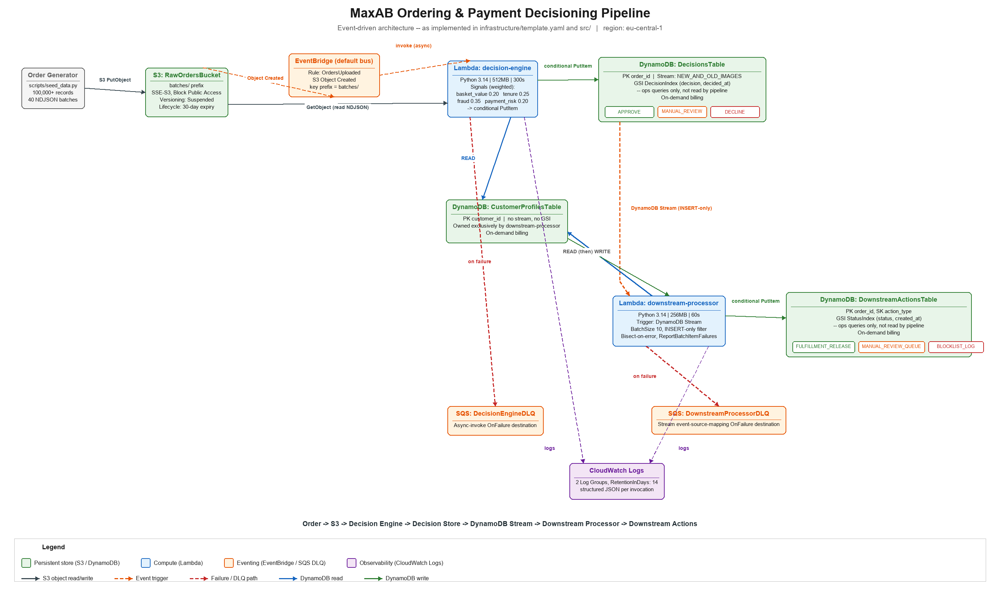

# MaxAB Ordering & Payment Decisioning Pipeline

Event-driven, serverless decisioning pipeline for Ordering & Payment records, built as a
take-home assessment for MaxAB. Ingests batched order data from S3, scores each order against
four independent risk signals, persists a multi-tier decision (`APPROVE` / `MANUAL_REVIEW` /
`DECLINE`) with full lineage, and triggers a downstream action off that write via DynamoDB
Streams. Entirely serverless, entirely within AWS Free Tier except for a small, deliberate
DynamoDB on-demand cost at full 100k-record scale (see [Cost estimate](#cost-estimate)).

## Architecture



One-page diagram generated from the actual implementation (`infrastructure/template.yaml` +
`src/**`), not a conceptual sketch -- see `scripts/generate_architecture_diagram.py` for how it
was produced. An editable source is also provided at `docs/architecture.drawio` (open at
[app.diagrams.net](https://app.diagrams.net) or in the draw.io desktop/VS Code extension).
Regenerating the PNG needs Pillow, kept out of `requirements.txt` (application/runtime + test
dependencies only) in a separate `requirements-dev.txt`:
```bash
pip install -r requirements-dev.txt
python scripts/generate_architecture_diagram.py
```

```
seed_data.py --> batched NDJSON files --> S3 (RawOrdersBucket, batches/ prefix)
                                            |  (EventBridgeConfiguration enabled on the bucket)
                                            v
                                  EventBridge default bus
                                            |  (rule: S3 Object Created, key prefix batches/)
                                            v
                              Lambda #1: decision-engine
                              per record: READS CustomerProfiles (never writes it)
                                          scores 4 independent signals
                                          combines into APPROVE/MANUAL_REVIEW/DECLINE
                                          individual conditional PutItem -> DecisionsTable
                                            |  (DynamoDB Stream, NEW_AND_OLD_IMAGES, INSERT-only)
                                            v
                              Lambda #2: downstream-processor
                              READS CustomerProfiles, safely initializes if absent
                              WRITES updated CustomerProfiles (sole owner of this table)
                              WRITES DownstreamActionsTable (action_type + status)
```

**Storage choice**: S3 for raw order batches (cheap bulk/batch storage, write-once/batch-read
access pattern, and the only AWS-native way to get an automatic ingestion trigger via
EventBridge). DynamoDB for decisions and profiles (single-digit-ms point lookups by
`order_id`/`customer_id`, and DynamoDB Streams is what makes the second trigger possible
without polling infrastructure). Neither S3 nor DynamoDB has an idle/hourly cost, so the stack
costs $0 between runs.

**Closed feedback loop**: `CustomerProfilesTable` is owned exclusively by the downstream
processor (it reads the current profile, safely initializes one if the customer has never been
seen, and writes the updated aggregate) and is read-only for the decision engine. This is a
deliberate correction from an earlier design where both Lambdas could write it -- that would
have created a write-write race between concurrent decision-engine invocations for the same
customer. The decision engine's `tenure_score` and part of `basket_score` on a customer's *next*
order are only correct because a *prior* order's downstream processing already updated the
profile -- verified live in [Validation results](#validation-results).

## Event flow

1. `seed_data.py` writes NDJSON batch files (2,500 records each, 40 files for 100k records) to
   `s3://<bucket>/batches/batch-{index:03d}.ndjson`.
2. S3 emits an `Object Created` event to the account's default EventBridge bus (this requires
   `NotificationConfiguration.EventBridgeConfiguration.EventBridgeEnabled: true` on the bucket --
   not a default). A rule scoped to the `batches/` prefix invokes `DecisionEngineFunction`.
3. The handler streams the S3 object line by line. For each record: reads (never writes)
   `CustomerProfilesTable`, cached per-invocation since nothing else can change it mid-invocation;
   scores the four signals (see [Decision logic](#decision-logic)); issues an **individual**
   conditional `PutItem` -- not `BatchWriteItem`, which cannot carry a per-item
   `ConditionExpression`:
   ```
   ConditionExpression = "attribute_not_exists(order_id) OR source_updated_at < :incoming"
   ```
   This makes writes idempotent under at-least-once delivery: a brand-new `order_id` is created;
   an exact replay (same `source_updated_at`) is a no-op skip; a genuinely later update
   (newer `source_updated_at`) overwrites; an out-of-order/stale redelivery is rejected. Writes
   for a batch are issued concurrently via a thread pool to stay well inside the 300s timeout.
4. Every successful create or update in `DecisionsTable` (stream enabled) emits a stream record.
   The event source mapping (batch size 10, `INSERT`-only filter) invokes
   `DownstreamProcessorFunction`. The `INSERT`-only filter means a later *update* to an existing
   decision doesn't re-trigger a downstream action -- trigger 2 fires exactly once per order's
   initial decision, which satisfies the requirement without re-processing complexity that wasn't
   asked for.
5. The handler reads `CustomerProfilesTable` for the customer (initializing a default if this is
   their first order to finish processing), computes updated aggregates (running average/stddev
   of basket value via Welford's algorithm, per-tier counters), writes the profile back
   unconditionally (safe -- this function is the table's only writer), derives an action from the
   decision (`APPROVE` -> `FULFILLMENT_RELEASE`/`COMPLETED`, `MANUAL_REVIEW` ->
   `MANUAL_REVIEW_QUEUE`/`PENDING`, `DECLINE` -> `BLOCKLIST_LOG`/`COMPLETED`), and writes it to
   `DownstreamActionsTable` with a conditional `PutItem` guarding against stream-record
   redelivery. Per-record failures are reported via `ReportBatchItemFailures` so one bad record
   doesn't block the rest of a batch.

## AWS resources

| Resource | Type | Notes |
|---|---|---|
| `RawOrdersBucket` | S3 | Block Public Access, SSE-S3, TLS-only bucket policy, 30-day lifecycle expiry on `batches/` |
| `DecisionsTable` | DynamoDB, on-demand | PK `order_id`, stream enabled (`NEW_AND_OLD_IMAGES`), GSI `DecisionIndex` (PK `decision`, SK `decided_at`) |
| `CustomerProfilesTable` | DynamoDB, on-demand | PK `customer_id`, owned exclusively by the downstream processor |
| `DownstreamActionsTable` | DynamoDB, on-demand | PK `order_id`, SK `action_type`, GSI `StatusIndex` (PK `status`, SK `created_at`) |
| `DecisionEngineFunction` | Lambda, Python 3.14, 512MB, 300s | Read-only IAM on `CustomerProfilesTable`, write-only on `DecisionsTable` |
| `DownstreamProcessorFunction` | Lambda, Python 3.14, 256MB, 60s | Full read/write IAM on `CustomerProfilesTable`, write on `DownstreamActionsTable` |
| `DecisionEngineDLQ`, `DownstreamProcessorDLQ` | SQS | On-failure destinations for both triggers |
| 2x Log Groups | CloudWatch Logs | Explicit `RetentionInDays: 14` (default is infinite retention) |
| `OrdersUploaded` rule | EventBridge, default bus | S3 `Object Created`, key prefix `batches/` |
| DynamoDB Streams event source mapping | -- | Batch size 10, `INSERT`-only filter, `ReportBatchItemFailures`, bisect-on-error |

All Lambda IAM policies are scoped to specific table/bucket/queue ARNs, never `*`. Full audit
trail of the deploy-time IAM policy (a separate, project-scoped customer-managed policy used
instead of broad managed policies like `PowerUserAccess`) is in the project history; see
[Deployment](#deployment) for the policy shape.

## Data generation and fraud scenarios

`scripts/seed_data.py` generates 100,000 synthetic records (deterministic, `--seed 42` default)
across 40 NDJSON batch files:

- **Customer skew**: 20,000-customer pool, Zipf-weighted (exponent 0.8) order assignment. In the
  actual generated dataset: 17,065 distinct customers appear, the top 20% account for 68.1% of
  orders, and the single largest customer accounts for 3.1% -- a realistic Pareto shape. (An
  earlier exponent of 1.3 was tried and rejected: it concentrated ~26% of all orders on one
  customer and left 14,500 of the 20,000-customer pool statistically unreachable.)
- **Day-part hour weighting**: `order_hour` is drawn from a weighted distribution shaped like a
  real grocery-delivery day (quiet overnight, ramp through the morning, lunch peak, higher dinner
  peak) rather than uniform across 24 hours. 4.1% of orders fall in the 0-5 "quiet" window vs.
  95.9% in normal hours.
- **Edge cases** (1.5% each, drawn from disjoint index pools so contradictory mutations to the
  same field -- e.g. zero and extreme basket value -- never silently collide):
  `zero_basket_value`, `extreme_basket_value` (8-12x the P99 breakpoint), `null_governorate`,
  `duplicate_order_id_update` (same `order_id` re-appears in a later batch with a changed field
  and a strictly later `source_updated_at`, exercising the conditional-`PutItem` update path).
- **Fraud-shaped anomalies** (3.0% total, two jointly-satisfiable combos -- see note below):
  first-order rows get `odd_hour` + `address_payment_mismatch` (1.5%); repeat-order rows get
  `velocity` + `device_reuse` (1.5%).

Two implementation clarifications resolved while building the generator and scoring logic
(documented in code, restated here):

1. **"Is this the customer's first order" is derived from the absence of a `CustomerProfiles`
   item**, not from the raw record's self-reported `is_first_order` field -- trusting a
   client-supplied flag for a signal that feeds fraud/override logic would be circular.
2. The original plan's illustrative fraud combo "velocity + odd-hour" is not jointly satisfiable
   under the exact scoring formulas (`odd_hour_flag` requires `is_first_order=True`; `velocity_flag`
   requires a *second* order from the same customer, i.e. `is_first_order=False` by definition).
   The generator instead uses the two combos listed above, which are.

Three real bugs were found and fixed while validating the generator against its own output
(not merely assumed correct): a Zipf exponent that over-concentrated the customer distribution
(above), `order_hour` being uniformly distributed despite being described as realistic (fixed
with the day-part weighting above, plus widening the dataset span to 60 days so the
"later batch implies strictly later timestamp" property the duplicate-update edge case depends
on holds provably, not just usually), and two independent edge-case/fraud construction passes
that could silently collide on the same row (fixed with disjoint sampling and a touched-row
exclusion set). All are covered by regression tests in `tests/unit/test_generator.py`.

## Decision logic

Four independently-computed signals, each a risk score in `[0, 1]`, combined by weighted sum with
two hard overrides checked first. Constants live in `src/common/models.py` and
`src/decision_engine/scoring.py`, tagged `ruleset_version = "v1"`.

| Signal | Weight | Formula |
|---|---|---|
| `basket_score` | 0.20 | First order: piecewise vs. dataset breakpoints (P50=250, P90=900, P99=2500 EGP) -> 0.1/0.3/0.6/0.9. Returning customer: `clamp(0.5 + 0.15 * z)` where `z` is the order's z-score against that customer's own running average/stddev. |
| `tenure_score` | 0.25 | `clamp(1 - (0.5 * min(account_age_days, 180)/180 + 0.5 * approval_rate))`. No profile: neutral prior (age=0, approval_rate=0.5). |
| `fraud_score` | 0.35 | Sum of independent rule flags, capped at 1: `velocity` (repeat order within 60 min, +0.4), `odd_hour` (hour 0-5 AND first order, +0.2), `address_payment_mismatch` (ip_country inconsistent with a non-null governorate, +0.2), `device_reuse` (`device_shared_count >= 3`, +0.2). |
| `payment_risk` | 0.20 | Static table: `card` 0.1, `wallet` 0.2, `cod` 0.5 (COD carries the highest real-world refusal/fraud-adjacent risk for a delivery business). |

**Hard overrides** (checked before the weighted score):
- `fraud_score >= 0.8` -> force `DECLINE` (`override_applied: FRAUD_SCORE_HARD_DECLINE`).
- `is_first_order AND payment_method == cod AND basket_value > P99` -> force `MANUAL_REVIEW`
  (`override_applied: FIRST_ORDER_COD_LARGE_BASKET_MANUAL_REVIEW`).

**Threshold bands** (weighted score, when no override fires): `< 0.35` APPROVE,
`0.35 <= x < 0.65` MANUAL_REVIEW, `>= 0.65` DECLINE.

Every `DecisionsTable` item persists the full lineage: each signal's score, weight, and raw
inputs; `overall_score`; `ruleset_version`; `override_applied`; `source_updated_at`;
`decided_at`; `lambda_request_id`; `source_s3_key`.

## Validation results

**Unit + integration tests**: 52 tests, all passing (`pytest tests/`) -- pure-function scoring
tests, generator statistical-shape tests including the three bug-regression cases above, and
moto-mocked integration tests for both Lambda handlers covering idempotency (exact replay,
legitimate update, out-of-order rejection), profile safe-initialization, and all three decision
tiers' downstream action mapping. No AWS calls, no cost.

**Smoke test** (live AWS, 3 hand-crafted records, 2 uploads ~15s apart): validated both triggers,
all three decision tiers, all three action mappings, the hard-override path, and -- by deliberately
spacing the two uploads -- the cross-invocation profile feedback loop (the second order's
`tenure`/`basket` scores were only correct because they read a profile the *first* order's
downstream processing had already written). Cost: unmeasurable (<$0.0001).

**Full 100k-record run** (live AWS): all 40 batches processed, 98,500/98,500 downstream actions
completed (100,000 records minus 1,500 intentional duplicate-update rows = 98,500 unique
`order_id`s, matching exactly), zero DLQ messages on either queue throughout.

| Decision | Count | % |
|---|---|---|
| APPROVE | 82,851 | 84.1% |
| MANUAL_REVIEW | 15,641 | 15.9% |
| DECLINE | 8 | 0.008% |

Cross-referencing all 3,000 generator-tagged fraud-shaped rows against their live decisions:
83.9% landed in MANUAL_REVIEW vs. 15.9% in the general population -- a ~5.3x lift, evidence the
scoring is discriminating on the injected anomalies rather than producing noise. DECLINE is rare
by design: neither injected fraud pattern reaches the 0.8 hard-decline threshold alone (velocity +
device_reuse = 0.6; odd_hour + mismatch = 0.4), so DECLINE requires either a rarer flag
combination or a severe weighted combination. Inspecting all 8 live DECLINEs individually: 7 of 8
were **not** generator-tagged fraud rows at all -- they were organic combinations (mostly a
natural `velocity` flag plus other risk factors) that the weighted formula pushed past 0.65 on
its own, which is what genuine multi-signal decisioning is supposed to look like rather than the
pipeline echoing back injected labels.

**End-to-end lineage trace**: one order (`ord_544c5c3012c3`) was traced through every hop with
matching, cross-referenced IDs pulled live from AWS -- S3 object -> decision-engine invocation ID
(matches the `lambda_request_id` stored on the `DecisionsTable` item) -> that item's full lineage
-> downstream-processor invocation log line (same `order_id`) -> `DownstreamActionsTable` item
(`source_decision_request_id` matches the *original* decision-engine invocation, not the
downstream one). One incidental finding, not a defect: repeated "connection pool is full"
`WARNING` log lines from the decision engine, because its write thread pool (16 workers) exceeds
boto3's default connection pool size (10) for the shared DynamoDB client. All writes still
succeeded (`errors: 0` on every batch) -- this is a minor performance-tuning opportunity
(raising `max_pool_connections` to >= the worker count), not a correctness issue, and was left
as-is per the "don't modify working code without a defect" constraint during validation.

## Cost estimate

Every resource in this design is free to *create*; billing is entirely usage-based, and nothing
has an idle/hourly charge.

| Resource | Free Tier coverage | 100k-run usage | Cost |
|---|---|---|---|
| Lambda (both functions) | Always Free (1M req + 400,000 GB-s/mo) | ~10,040 invocations | $0 |
| SQS (both DLQs) | Always Free (1M req/mo) | 0 messages (success path) | $0 |
| EventBridge | Not billed for S3-sourced default-bus events | 40 rule matches | $0 |
| IAM | Never billed | -- | $0 |
| DynamoDB Streams reads | Always Free (2.5M stream-read req/mo) | well under limit | $0 |
| DynamoDB storage (all 3 tables) | Always Free up to 25GB, any billing mode | tens of MB | $0 |
| S3 (bucket + requests) | 12-month new-account tier (5GB/2,000 PUT) | 40 PUT, ~39MB | $0 (or a fraction of a cent if inapplicable) |
| CloudWatch Logs | 12-month new-account tier (5GB) | tens of MB, 14-day retention | $0 (or a fraction of a cent if inapplicable) |
| **DynamoDB on-demand requests (WRU/RRU)** | **No free tier at any account age** | ~495,500 WRU + ~80,000-100,000 RRU (measured) | **~$0.70-0.75, one-time** |

This is the one deliberate non-free line item, accepted because provisioned 25 WCU/25 RCU (the
only literally-always-free DynamoDB capacity mode) would have throttled a 100k-record burst
upload to a ~3.5-5.5 hour seed instead of minutes -- a bad trade for a one-time run. AWS
Billing/Cost Explorer typically lags ~24h before showing a given day's usage, so this is a
usage-based estimate, not yet the authoritative billed figure.

## Deployment

Prerequisites: Python 3.14 (matches the deployed Lambda runtime exactly -- AWS Lambda added a
`python3.14` managed runtime in November 2025), AWS CLI v2, AWS SAM CLI, an AWS account/credentials
with permission to create the resources above.

```bash
# 1. Local setup
pip install -r requirements.txt
pytest tests/                          # 52 tests, no AWS calls

# 2. Generate the dataset (deterministic, ~3.4s for 100k records)
python scripts/seed_data.py            # writes data/batches/*.ndjson (gitignored)

# 3. Build and deploy the stack
cd infrastructure
sam build
sam deploy \
  --template-file .aws-sam/build/template.yaml \
  --stack-name maxab-decisioning \
  --region eu-central-1 \
  --s3-bucket <a pre-existing bucket for SAM deployment artifacts> \
  --s3-prefix maxab-decisioning \
  --capabilities CAPABILITY_IAM \
  --no-confirm-changeset

# 4. Seed the pipeline
aws s3 sync data/batches s3://<RawOrdersBucketName-from-stack-outputs>/batches/
```

This project deliberately avoided broad managed policies (e.g. `PowerUserAccess`) for the
deploying IAM identity in favor of a project-scoped customer-managed policy: every mutating
action confined to `maxab-decisioning*`-named resources in one account/region, with an explicit
`Deny` on IAM user/credential/account-management actions as a backstop. A handful of actions
(`cloudformation:ValidateTemplate`, `lambda:CreateEventSourceMapping` and its siblings,
`sts:GetCallerIdentity`) necessarily use `Resource: "*"` because AWS does not support
resource-level scoping for them at all -- never a blanket capability grant. The deploying identity
also needs `cloudformation:CreateChangeSet` on the fixed, AWS-owned transform ARN
`arn:aws:cloudformation:<region>:aws:transform/Serverless-2016-10-31`, required by any SAM
template regardless of scope, since the template uses `Transform: AWS::Serverless-2016-10-31`.

A one-time bootstrap bucket for SAM's deployment artifacts (Lambda zip packages) must exist
*before* the first deploy, since it can't be created by the same stack it's staging artifacts for.

## Teardown

`scripts/teardown.sh` encodes the exact validated sequence. Run with the deploying profile for
steps 1-4; steps 5-6 need broader (admin/root) permissions and are printed, not executed, by the
script, matching the deploying identity's intentionally narrow scope:

1. Empty `RawOrdersBucket` of current objects.
2. **Delete its delete markers explicitly.** This bucket has `VersioningConfiguration.Status:
   Suspended`, set at creation. Despite the name, this still makes the bucket version-aware:
   deleting an object creates a `null`-version delete marker rather than truly removing it.
   CloudFormation refuses to delete a non-empty bucket, and "non-empty" here includes delete
   markers -- `aws s3 rm --recursive` alone leaves the bucket looking empty but still blocking
   stack deletion, which was discovered and fixed during this project's own teardown, not assumed.
3. Delete the CloudFormation stack (all 11 app resources).
4. Empty and delete the SAM artifacts bucket.
5. Verify no `maxab-decisioning*` resources remain (S3, DynamoDB, Lambda) -- needs an admin
   profile with list-all permissions the deploying identity deliberately doesn't have.
6. IAM cleanup: detach the deploy policy from the deploy user, delete its access key, delete the
   user, delete all non-default policy versions, delete the policy -- also needs an admin profile,
   since the deploy policy explicitly denies these actions on itself as a defense-in-depth measure.

```bash
PROFILE=maxab-deploy REGION=eu-central-1 ./scripts/teardown.sh
```
